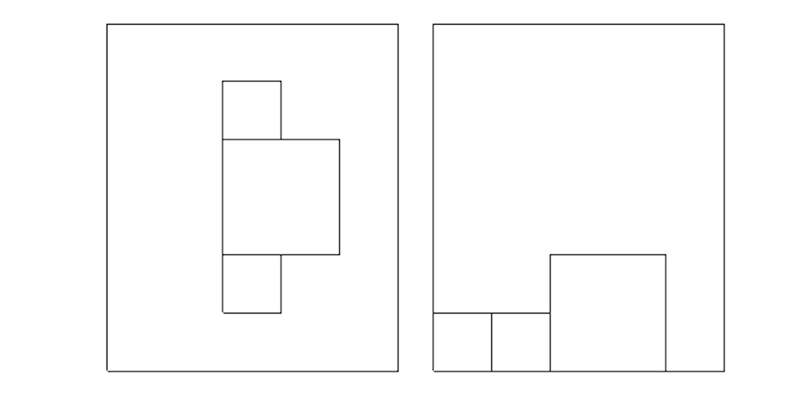
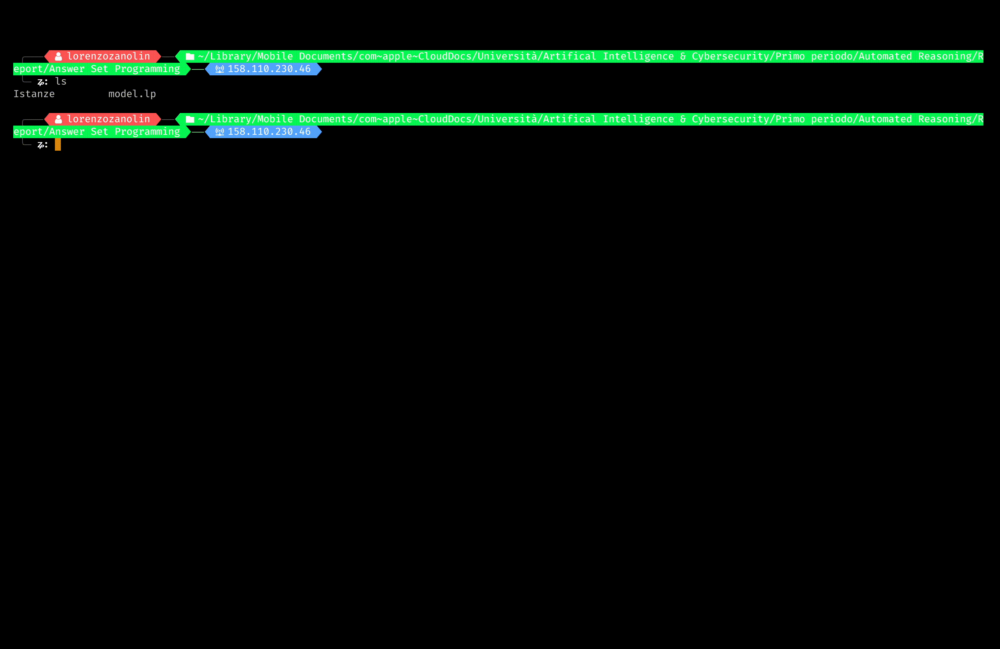
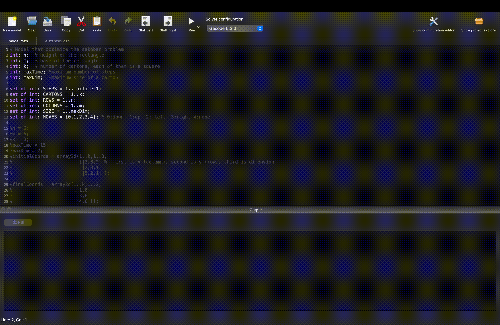
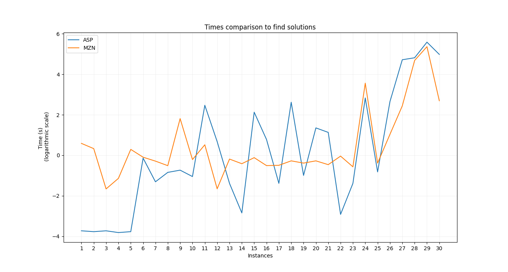

# Automated Reasoning Optimization Problem
Minizinc and ASP models of simil-Sokoban Optimization Problem[^fn1].
The aim of the project is to confront benchmarks of two models over different kinds of instances.

|  |
|:--:|
| <b>Optimization problem</b>|

The complete overview of the project is inside `report.pdf`.

## Project structure

The structure of the src folder is the following:

-   `Answer Set Programming`: contains ASP model and istances.

-   `Constraint Programming`: contains MZN model and istances.

-   `Plots`: contains benchmarks and Python script to print them.

-   `TeX`: contains the latex source of the report.

-   `Instances generator`: contains the python script used to generate istances.


## Usage

Both models use 30 instances contained in the respective folders `./Istanze/`. 

### Answer Set Programming
The models is `./Answer Set Programming/model.lp` and it's written in Answer Set Programming[^fn2].

To launch the program you need Clingo.

```
cd Answer\ Set\ Programming/
clingo model.lp Istanze/istance.lp

NOTE: There are 30 istances, categorized by their difficulty. Read the report for major details. 
```

|  |
|:--:|
| <b>Example of the usage</b>|

Keep in mind that with the more the complexity of the instances increases the more time is required by the model to compute the optimal solution.

### Constraint Programming
The model is `./Constraint Programming/model.mzn` and it's written in MiniZinc.

To launch the program you need either MiniZinc IDE (suggested) or MiniZinc.

Within MiniZinc IDE you simply need to import both model and the istance you want to execute, then simply click on Run.

|  |
|:--:|
| <b>Example of the usage</b>|

### Benchmarks

The report contains a detailed analysis of the performances evaluated by the two models over 30 instances. In the following figures you can see them.

|  |
|:--:|
| <b>Solutions time</b>|

|  |
|:--:|
| <b>Computations time</b>|


[comment]: <> (Citations)

[^fn1]: [SOK] Andreas Junghanns and Jonathan Schaeffer. Sokoban: A challenging single-agent search problem. In International Joint Conference on Artificial Intelligence, 1997.

[^fn2]: [ASP] Wikipedia contributors. "Answer set programming." Wikipedia, The Free Encyclopedia. Wikipedia, The Free Encyclopedia, 27 Apr. 2023. Web. 5 May. 2023.
